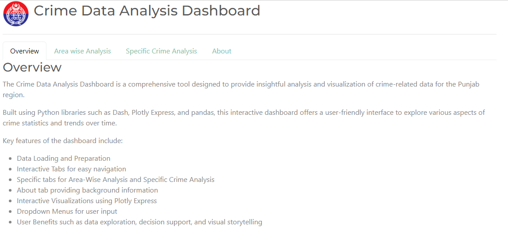
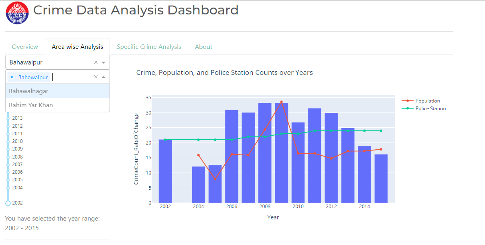
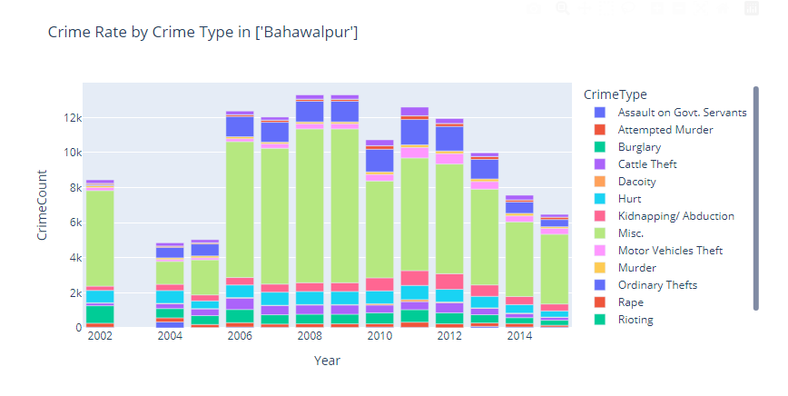
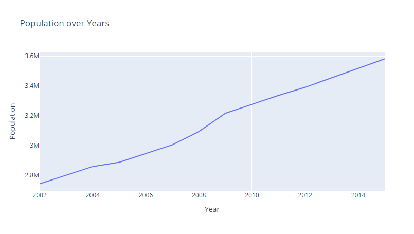
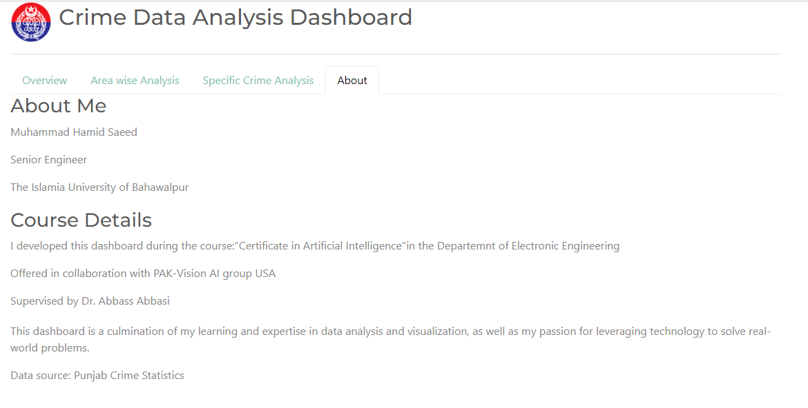

# Crime Data Analysis Dashboard

This interactive dashboard provides a comprehensive analysis of crime data in the Punjab region, leveraging Python libraries such as Dash, Plotly Express, and pandas for data visualization and exploration.

## Table of Contents

- [Overview](#overview)
- [Features](#features)
- [Installation](#installation)
- [Usage](#usage)
- [Data](#data)
- [Screenshots](#screenshots)
- [Contributing](#contributing)
- [License](#license)
- [Acknowledgments](#acknowledgments)

## Overview

The **Crime Data Analysis Dashboard** allows users to explore crime trends across Punjab over time, broken down by divisions, districts, and specific crime types. Users can interact with the data using dropdowns, sliders, and graphs to gain insights into crime statistics and their relation to population and police presence.

## Features

- **Interactive Data Visualization**: Charts and graphs built using Plotly Express.
- **Area-wise Analysis**: Filter data by division, district, and year range.
- **Specific Crime Analysis**: Visualize trends of particular crimes over the years.
- **User-friendly Interface**: Easy navigation with tabs for different types of analyses.
- **Dynamic Filtering**: Dropdowns for selecting divisions, districts, and crime types.
- **Year Range Slider**: Adjust the year range for crime data analysis.
- **Responsive Design**: Works seamlessly on different screen sizes (Dash Bootstrap).

## Installation

To set up the project locally, follow these steps:

### Prerequisites

- Python 3.7 or higher
- pip (Python package manager)
- [Dash](https://dash.plotly.com/installation) framework
- Other dependencies are listed in the `requirements.txt` file

### Steps

1. Clone this repository:
   ```bash
   git clone https://github.com/hamidsaeed13/Crime-Data-Analysis-Dashboard.git
   cd crime-data-dashboard
## Screenshots

### 1. Dashboard Overview
The main landing page of the Crime Data Analysis Dashboard. It provides users with introductory information about the application, along with a clean and responsive layout for navigation.



---

### 2. Filter Menu
This section displays the interactive filter menu, where users can select divisions, districts, and specific crime types. The year range slider allows for flexible analysis across different time periods.



---

### 3. Crime Trends Graph
A dynamic and interactive graph visualizing crime trends over the selected time period. This graph updates based on the selected filters, offering insights into specific types of crimes for different regions.



---

### 4. Area-wise Analysis
Users can view crime data for specific divisions and districts, broken down by different crime types. This section allows for detailed comparative analysis between regions.



---

# About




---

